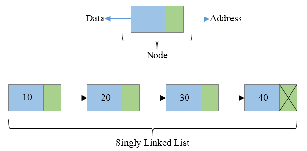

# Linked List

Linked lists are commonly used data structures that can also be implemented as stacks, queues, etc. They usually consist of data (a value) and pointers to one or more nodes in the list.

## Singly-Linked List

A singly-linked list stores nodes that contain data (a value) and a pointer to the next node.

Optimizations for insertion/deletion operations can be made by tracking the head (first node) and tail (last node) of the list, allowing operations on either side to be done in linear time.

**Time Complexity**

- Insertion: O(1)
- Access: O(n)
- Search: O(n)
- Deletion: O(1)

Estimations refer to inserting and deleting nodes as O(1) since, if the node is known, it only requires updating pointers. Traversal has a complexity of O(n), meaning traversal + insertion would have O(n+1) complexity, or just O(n).

**Space Complexity**

O(n)
